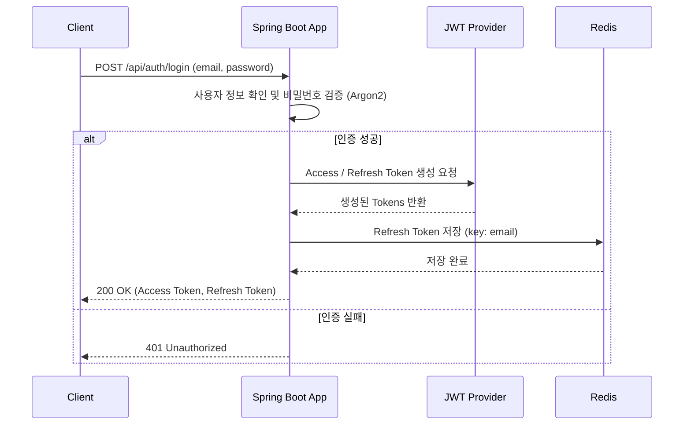
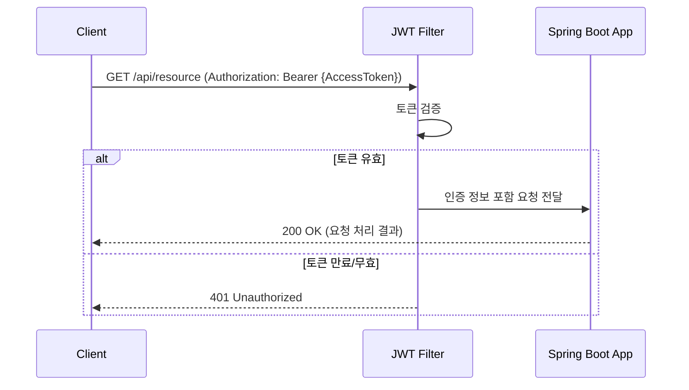

# Spring Security JWT & OAuth 2.0 예제

본 프로젝트는 Spring Security를 활용하여 JWT(JSON Web Token) 기반의 토큰 인증과 OAuth 2.0을 이용한 소셜 로그인을 구현한 예제입니다.

## ✨ 주요 기능

- **인증 및 인가**: Spring Security를 사용한 인증 및 인가 처리 (완료)
- **JWT 기반 인증**: 로그인 성공 시 JWT를 발급하고, 요청 시 토큰을 검증하여 사용자를 인증 (완료)
- **소셜 로그인**: OAuth 2.0을 이용한 Google, Naver, Kakao 등 소셜 로그인 연동 (예정)
- **안전한 비밀번호 관리**: `Argon2PasswordEncoder`를 사용하여 비밀번호를 안전하게 해시하여 저장 (완료)

## 🛠️ 기술 스택

- Spring Boot
- Spring Security
- JWT (JSON Web Token)
- OAuth 2.0

## 시퀀스 다이어그램

### 1. 로컬 로그인 (ID/Password) 및 JWT 발급



### 2. JWT를 이용한 API 요청




## 📝 트러블슈팅

### `Argon2PasswordEncoder.encode()` 사용 시 에러

`Argon2PasswordEncoder` 사용 시 Bouncy Castle 라이브러리가 필요합니다. 해당 라이브러리가 프로젝트에 포함되어 있지 않으면 에러가 발생할 수 있습니다.

- **해결 방법**: `build.gradle`에 아래 의존성을 추가합니다.
  ```groovy
  implementation 'org.bouncycastle:bcprov-jdk15on:1.64'
  ```
- **관련 이슈**: spring-projects/spring-security#8842